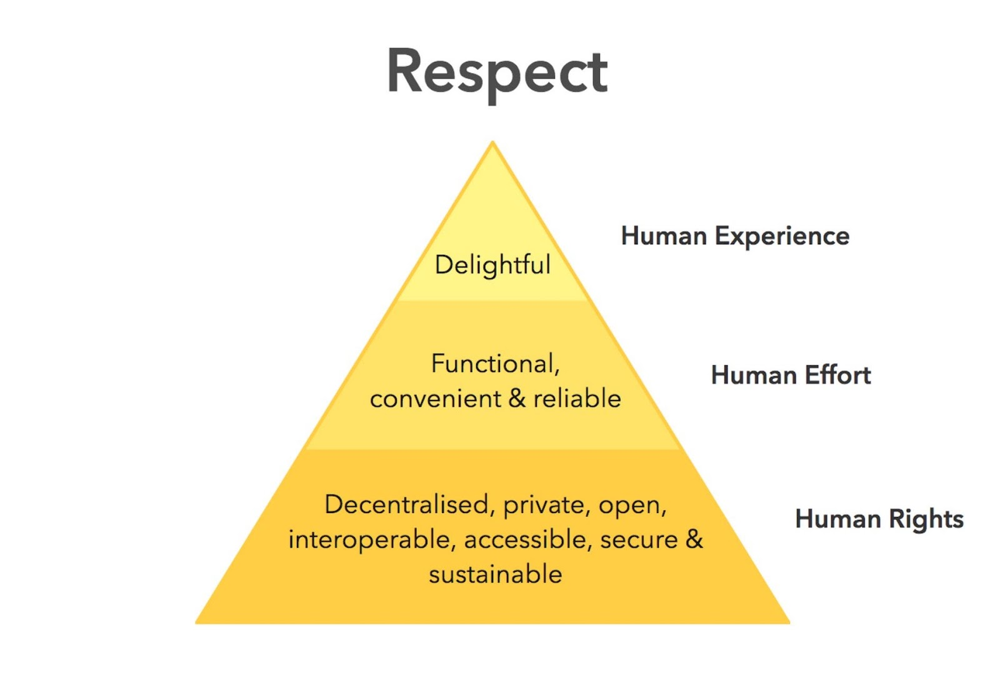
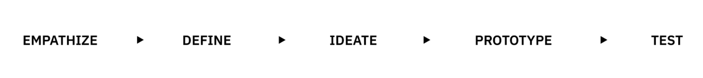
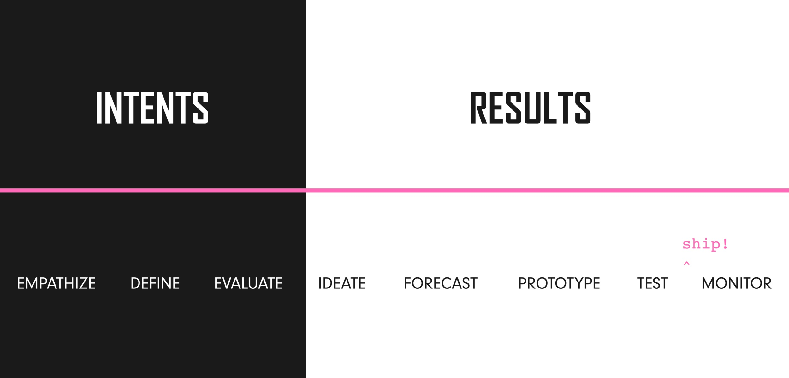
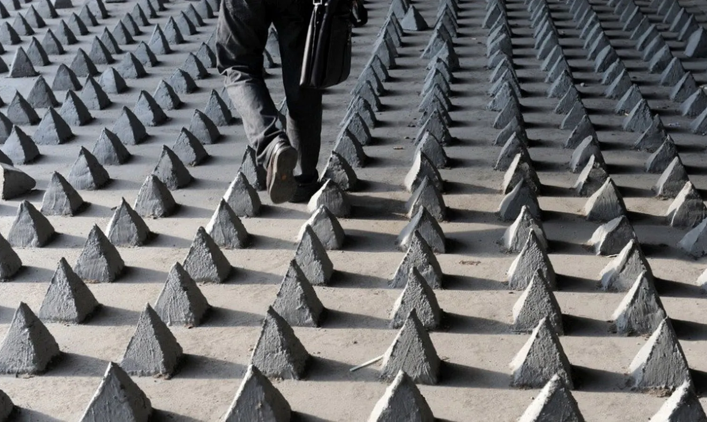

# Creating with Heart: A Introduction to Ethical Design 💖

## Introduction

Photo filters alter users' faces and contribute to a negative impact on mental health and a decline in confidence levels among users. Whether you recognize it or not - you are faced with ethically challenging products daily. What do all these products and filters have in common? *They were designed by designers.*

Imagine a world where every product you use, from your favorite app's photo filters to your morning coffee maker, is designed with your well-being at its core. What if each design decision was made not just for profit, but for the greater good of society and the environment? This is the promise of ethical design—a philosophy that insists on placing focus on the *human* and *responsibility* throughout the creative process.

No, you don't have to be a designer to practice ethical design. The framework can be applied across any process that involves creating something for an end user. Afterall, everyone could use a reminder to sprinkle a little more human-centered ethics into their decision-making. ✨

## What is Ethical Design Anyway?

Ethical design should aim to make products that are good for *users*, *business*, and for *society*—all while keeping the human at the center of all decision-making.
In the end, the resulting product should help the user accomplish what they want, meet their individual needs, be easy and pleasant to use, with little to no effects on them and their environment. It's more important than ever to take time to consider the ethical consequences behind decisions.

## Principles of Ethical Design
To understand a bit more on the principles of Ethical Design, we can take a look at the "Ethical Hierachy of Needs" created by Aral Balkan and Laura Kalbag, inspired by the United Nations Declaration of Human Rights. It illustrates how each element depends closely on each layer to make sure ethical design is met. If one of these layers are unfulfilled, then the pyramid will collapse. We *don’t* want that!

*The Ethical Hierarchy of Needs, Aral Balkan and Laura Kalbag*

When you want to ensure that your design or process is *ethical* and want to prevent a collapse, you can refer to this pyramid. This framework illustrates that, at its core, a user’s experience must abide by human rights. A common example of this pillar is when companies steal user data. If a design already fails this first pillar...BOOM...collapse. *Back to the ethical drawing board and let’s try that again.*

If you made it past the first pillar and established that the design or process meets human rights, then you need to analyze whether it is functional and reliant to pass the second pillar.

*Can the user manage to resolve their issue clearly and without frustration?* Check! ✅

Let’s move on to the last pillar: your design should aim to be delightful! This means that not only are your users solving their problems with ease, but it’s also a fun process and can bring a smile to their face!

## Making Your Creative Process More Ethical

Now you may be thinking: how can you use this Ethical Hierarchy of Needs to ensure that ethical design principles are considered starting already in your workflow? One way to approach this is by starting from the very beginning and redefining your design process. [Kat Zhou](https://www.katherinemzhou.com/), a writer, speaker, organizer and incoming DPhil candidate at the University of Oxford, has redesigned and proposed a new way to approach the design thinking process in a more holistic way. Starting with the classic [Standford d.School's Design Thinking Process](https://dschool-old.stanford.edu/sandbox/groups/designresources/wiki/36873/attachments/74b3d/ModeGuideBOOTCAMP2010L.pdf) as her base, Zhou introduces a few new steps into her model. Standford's Design Thinking Process has these steps:

*Image by Kat Zhou*

Zhou adds in four new steps below (Evaluate, Forecast, Ship, and Monitor) to factor in more ethical thinking in the design process as part of her  < Design Ethically > framework. [If you are interested, you can read more about it here.](https://www.designethically.com/framework) 

*Image and redesigned process by Kat Zhou*

Here is a brief explanation of the new steps:
- **🔍 Evaluate:** This step includes looking at the problem statement at hand and closely analyzing if it passes the test of ethics. An example is finding out early on that your product's new feature may by wrongfully stealing user data and breaching their data privacy. If you can already figure this out early on in your process, it may be worth revaluating if this new feature is worth it to continue to pursue.
- **🔮 Forecast:** Look into the magical crystal ball of the future! You will want to gather all the ideas that your team has brainstormed and try to see if there are any ethical weak spots or areas for potential exploitation.
- **🚀 Ship:** After extensive user testing and thorough forecasting of any potential ethical challenges, time to ship that product out into the real world! Yay!
- **🛠️ Monitor:** Keep a continuous feedback loop open after you ship that product to see if there are any ethical problems that your team can address right away.

## Ethical Challenges in an Evolving World

*Image Credit © China Hush*

Every day, designers face many ethical challenges in their work. An extreme example can be seen in the creation of harmful products, such as weapons, exclusionary structures like hostile architecture, and tools like photo filters that impact mental health. Hostile architecture is an interesting one to look at. As defined by the [Neighborhood Design Center](https://ndc-md.org/news-and-stories/understanding-hostile-architecture-the-cause-and-effect-of-restricting), it is “an urban design strategy in which public spaces and structures are used to prevent certain activities or restrict certain people from using those spaces.” Examples of this can include the specific placement of elements such as bike racks or large planters that prevent homeless individuals from being able to camp or rest in these areas. An extreme version is even spikes installed in various public spaces, such as under bridges, to prevent homeless individuals from using them as shelter, forcing them to move out. Interested in more examples of hostile architecture? [Read more here](https://www.re-thinkingthefuture.com/designing-for-typologies/hostile-architecture-anti-homeless-architecture/https://www.re-thinkingthefuture.com/designing-for-typologies/hostile-architecture-anti-homeless-architecture/).

All these examples have one common thread: they prioritize aesthetics and profit over human well-being. The societal consequences—ranging from increased violence and homicide, widening social inequality to severely diminished self-esteem—show the crucial need for designers to slow down and really consider the long-term effects of their work and to strive for more ethical compassion in what they put out into the world.

## The Future of Ethical Design
I hope that this article was an interesting introduction to the topic of ethical design.

A challenge for you, dear reader, is to take a look into your own creative process and try to incorporate one or both of the tools introduced in this article when building your next product or starting a new project: the *Ethical Hierarchy of Needs* and the *Design Ethically framework*.

Ethical design isn’t just a set of rules—it’s a mindset, a commitment to creating with care and consideration to the end user and to the world. By embracing these principles, we can design a world that’s not only more innovative but also more just and sustainable. Let’s make ethical design the heart of our creative journey by building a culture that places the human at the forefront of all that we do! 🧠❤️ 